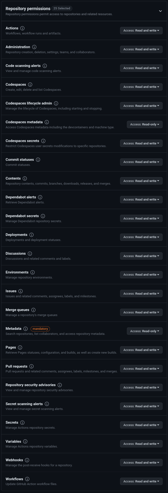
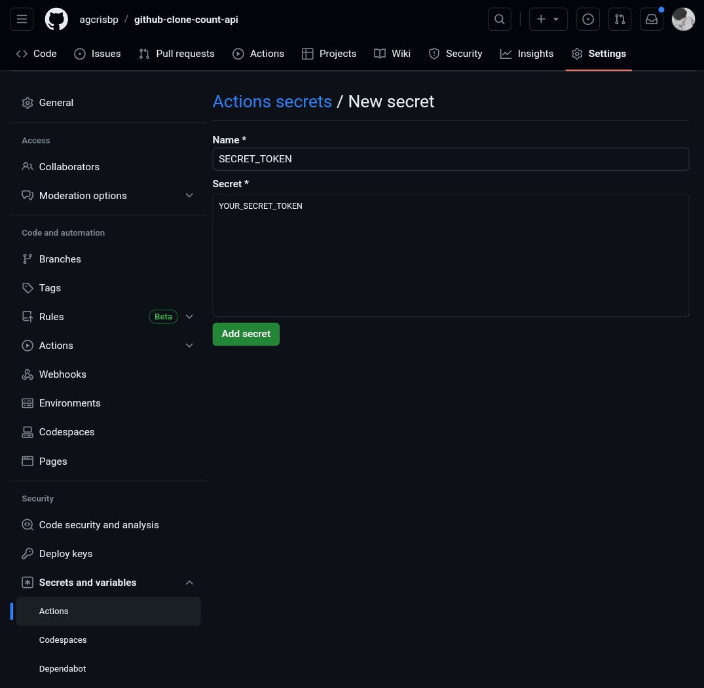

<p align="center">
    
</p>

# GitHub Clone Count APi

## Setup
1) Create a new workflow from the `Actions` tab of your repository and paste the following.
```yaml
name: GitHub Clone Count Update 24h

on:
  schedule:
    - cron: "0 */24 * * *"
  workflow_dispatch:

jobs:
  build:
    runs-on: ubuntu-latest

    steps:
      - uses: actions/checkout@v2
      
      - name: gh login
        run: echo "${{ secrets.SECRET_TOKEN }}" | gh auth login --with-token

      - name: parse latest clone count
        run: |
          curl --user "${{ github.actor }}:${{ secrets.SECRET_TOKEN }}" \
            -H "Accept: application/vnd.github.v3+json" \
            https://api.github.com/repos/${{ github.repository }}/traffic/clones \
            > clone.json

      - name: create gist and download previous count
        id: set_id
        run: |
          if gh secret list | grep -q "GIST_ID"
          then
              echo "GIST_ID found"
              echo ::set-output name=GIST::${{ secrets.GIST_ID }}
              curl https://gist.githubusercontent.com/${{ github.actor }}/${{ secrets.GIST_ID }}/raw/clone.json > clone_before.json
              if cat clone_before.json | grep '404: Not Found'; then
                echo "GIST_ID not valid anymore. Creating another gist..."
                gist_id=$(gh gist create clone.json | awk -F / '{print $NF}')
                echo $gist_id | gh secret set GIST_ID
                echo ::set-output name=GIST::$gist_id
                cp clone.json clone_before.json
                git rm --ignore-unmatch  CLONE.md
              fi
          else
              echo "GIST_ID not found. Creating a gist..."
              gist_id=$(gh gist create clone.json | awk -F / '{print $NF}')
              echo $gist_id | gh secret set GIST_ID
              echo ::set-output name=GIST::$gist_id
              cp clone.json clone_before.json
          fi

      - name: update clone.json
        run: |
          curl https://raw.githubusercontent.com/agcrisbp/github-clone-count-api/master/main.py > main.py
          python3 main.py

      - name: Update gist with latest count
        run: |
          content=$(sed -e 's/\\/\\\\/g' -e 's/\t/\\t/g' -e 's/\"/\\"/g' -e 's/\r//g' "clone.json" | sed -E ':a;N;$!ba;s/\r{0,1}\n/\\n/g')
          echo '{"description": "${{ github.repository }} clone statistics", "files": {"clone.json": {"content": "'"$content"'"}}}' > post_clone.json
          curl -s -X PATCH \
            --user "${{ github.actor }}:${{ secrets.SECRET_TOKEN }}" \
            -H "Content-Type: application/json" \
            -d @post_clone.json https://api.github.com/gists/${{ steps.set_id.outputs.GIST }} > /dev/null 2>&1

          if [ ! -f CLONE.md ]; then
            shields="https://img.shields.io/badge/dynamic/json?color=success&label=Clone&query=count&url="
            url="https://gist.githubusercontent.com/${{ github.actor }}/${{ steps.set_id.outputs.GIST }}/raw/clone.json"
            repo="https://github.com/agcrisbp/github-clone-count-api"
            echo ''> CLONE.md
            echo '
            **Markdown**

            ```markdown' >> CLONE.md
            echo "[]($repo)" >> CLONE.md
            echo '
            ```

            **HTML**
            ```html' >> CLONE.md
            echo "<a href='$repo'></a>" >> CLONE.md
            echo '```' >> CLONE.md
            
            git add CLONE.md
            git config --global user.name "GitHub Action"
            git config --global user.email "action@github.com"
            git commit -m "create clone count badge"
          fi

      - name: Push
        uses: ad-m/github-push-action@master
        with:
          github_token: ${{ secrets.GITHUB_TOKEN }}

```
2) But to use this, you will need a [personal access token](https://github.com/settings/tokens?type=beta) and make sure to select the following scopes

<p align='center'></p>

3) Next, add action secrets to this repository like https://docs.github.com/en/actions/reference/encrypted-secrets#creating-encrypted-secrets-for-a-repository this. Remember `SECRET_TOKEN` must be the secret name. And the value will be the **[personal access token](https://github.com/settings/tokens?type=beta)** you just generated.  

<p align='center'></p>